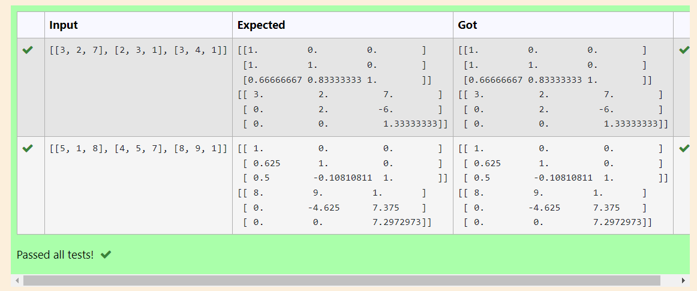

# LU Decomposition 

## AIM:
To write a program to find the LU Decomposition of a matrix.

## Equipments Required:
1. Hardware – PCs
2. Anaconda – Python 3.7 Installation / Moodle-Code Runner

## Algorithm
1. 
2. 
3. 
4. 

## Program:
(i) To find the L and U matrix
```
/*
Program to find the L and U matrix.
Developed by: M.Hashwatha
RegisterNumber: 23012398
*/

import numpy as np
from scipy.linalg import lu
arr=np.array(eval(input()))
P,L,U=lu(arr)
print(L)
print(U)

```
(ii) To find the LU Decomposition of a matrix
```
/*
Program to find the LU Decomposition of a matrix.
Developed by: M.Hashwatha
RegisterNumber: 23012398
*/

from scipy.linalg import lu_factor,lu_solve
import numpy as np
arr=eval(input())
constant=eval(input())
A=np.array(arr)
B=np.array(constant)
result=lu_factor(A)
solution=lu_solve(result,B)
print(solution)

```

## Output:
(1) ## To find the L and U matrix



(2) ## To find the LU Decomposition of a matrix


## Result:
Thus the program to find the LU Decomposition of a matrix is written and verified using python programming.